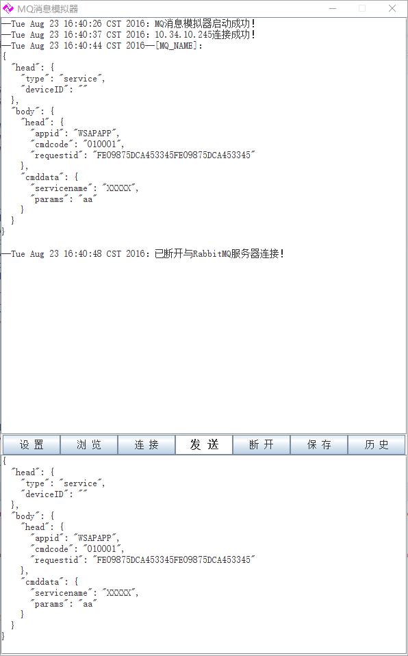

MQEmulator使用说明
===
---

MQEmulator界面主要分为 **接收区**（禁用编辑）、 **控制区**和 **发送区**（可编辑），其中控制区功能如下：

- **设置**：设置RabbitMQ服务器的IP和监听的MQ队列，设置完成会自动进行重连；
- **浏览**：选择加载要发送的报文文件（不区分后缀的json文本文件）；
- **连接**：连接RabbitＭＱ服务器（默认连接10.34.10.245，可换10.34.10.121/10.34.10.159）；
- **发送**：发送ＭＱ消息（发送的消息为下半窗口内填写的json格式内容）；
- **断开**：断开与ＭＱ连接；
- **保存**：保存收到的ＭＱ消息（保存上半窗口接收到的消息记录到文本文件，不区分后缀）；
- **历史**：查看保存的ＭＱ消息文件（查看 **保存**操作生成的历史消息记录）；