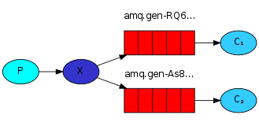

RabbitMQ
===

###消息队列概念
-

>AMQP(高级消息队列协议) 是一个异步消息传递所使用的应用层协议规范，作为线路层协议，而不是API（例如JMS），AMQP 客户端能够无视消息的来源任意发送和接受信息。AMQP的原始用途只是为金融界提供一个可以彼此协作的消息协议，而现在的目标则是为通用消息队列架构提供通用构建工具。因此，面向消息的中间件 （MOM）系统，例如发布/订阅队列，没有作为基本元素实现。反而通过发送简化的AMQ实体，用户被赋予了构建例如这些实体的能力。这些实体也是规范的一 部分，形成了在线路层协议顶端的一个层级：AMQP模型。这个模型统一了消息模式，诸如之前提到的发布/订阅，队列，事务以及流数据，并且添加了额外的特性，例如更易于扩展，基于内容的路由。

>AMQP当中有四个概念非常重要：virtual host/虚拟主机，exchange/交换机，queue/队列，binding/绑定。
一个虚拟主机持有一组交换机、队列和绑定。为什么需要多个虚拟主机呢？因为RabbitMQ当中，用户只能在虚拟主机的粒度进行权限控制。因此，如果需要禁止A组访问B组的交换机/队列/绑定，必须为A和B分别创建一个虚拟主机。每一个RabbitMQ服务器都有一个默认的虚拟主机。

>队列（Queues）是你的消息（messages）的终点，可以理解成装消息的容器。消息就一直在里面，直到有客户端（也就是消费者，Consumer）连接到这个队列并且将其取走为止。不过，也可以将一个队列配置成这样的：一旦消息进入这个队列，此消息就被删除。
队列是由消费者（Consumer）通过程序建立的，不是通过配置文件或者命令行工具。这没什么问题，如果一个消费者试图创建一个已经存在的队列，RabbitMQ会直接忽略这个请求。因此我们可以将消息队列的配置写在应用程序的代码里面。
而要把一个消息放进队列前，需要有一个交换机（Exchange）。交换机（Exchange）可以理解成具有路由表的路由程序。每个消息都有一个称为路由键（routing key）的属性，就是一个简单的字符串。交换机当中有一系列的绑定（binding），即路由规则（routes）。（例如，指明具有路由键 "X" 的消息要到名为timbuku的队列当中去。）

>消费者程序（Consumer）要负责创建你的交换机。交换机可以存在多个，每个交换机在自己独立的进程当中执行，因此增加多个交换机就是增加多个进程，可以充分利用服务器上的CPU核以便达到更高的效率。例如，在一个8核的服务器上，可以创建5个交换机来用5个核，另外3个核留下来做消息处理。类似的，在RabbitMQ的集群当中，你可以用类似的思路来扩展交换机一边获取更高的吞吐量。

>交换机如何判断要把消息送到哪个队列？你需要路由规则，即绑定（binding）。一个绑定就是一个类似这样的规则：将交换机"desert（沙漠）"当中具有路由键"阿里巴巴"的消息送到队列"hideout（山洞）"里面去。换句话说，一个绑定就是一个基于路由键将交换机和队列连接起来的路由规则。例如，具有路由键"audit"的消息需要被送到两个队列，"log-forever"和"alert-the-big-dude"。要做到这个，就需要创建两个绑定，每个都连接一个交换机和一个队列，两者都是由"audit"路由键触发。在这种情况下，交换机会复制一份消息并且把它们分别发送到两个队列当中。交换机不过就是一个由绑定构成的路由表。

>交换机有多种类型。他们都是做路由的，但是它们接受不同类型的绑定。为什么不创建一种交换机来处理所有类型的路由规则呢？因为每种规则用来做匹配分子的CPU开销是不同的。例如，一个"topic"类型的交换机试图将消息的路由键与类似"dogs.*"的模式进行匹配。匹配这种末端的通配符比直接将路由键与"dogs"比较（"direct"类型的交换机）要消耗更多的CPU。如果你不需要"topic"类型的交换机带来的灵活性，你可以通过使用"direct"类型的交换机获取更高的处理效率。在接口调用部分将详细说明几种基本类型交换机的使用。


###MQ结构流程
-

MQ的基本结构可简单描述如下，其中X即代表交换机。		


MQ消息流程说明:

- Producer：连接验证MQ Server，创建一个频道，声明EXCHANGE_NAME或者QUEUE_NAME，（指定RoutingKey），然后使用MQ的basicPublish接口发送消息。需要说明的是，basicPublish第一个参数为交换机名，第二个为队列名或者路由规则，当使用的交换机类型不为""时，将会自动忽略QUEUE_NAME而将第二个参数作为路由规则使用；
- Consumer：连接验证MQ Server，创建一个频道，声明EXCHANGE_NAME或者QUEUE_NAME，（指定RoutingKey），创建消费者并与QUEUE_NAME绑定，然后使用MQ的nextDelivery阻塞方法获取消息。需要说明的是，如果声明的是EXCHANGE_NAME，声明队列时就需要使用Channel的queueDeclare().getQueue()方法来创建一个系统自动维护的随机队列，然后将其与交换机以及指定的RoutingKey绑定；


###MQ API简介
-

MQ发送端：
   
```
ConnectionFactory factory = new ConnectionFactory();
//设置MabbitMQ所在主机ip或者主机名
factory.setHost("10.34.10.245"); 
factory.setUsername("admin");
factory.setPassword("admin");
//创建一个连接
Connection connection = factory.newConnection();
//创建一个频道
Channel channel = connection.createChannel();
//指定一个队列
channel.queueDeclare(QUEUE_NAME, true, false, false, null); //参数2声明队列持久化
//发送的消息
String message = "hello world!";
//往队列中发出一条消息
channel.basicPublish("", QUEUE_NAME, MessageProperties.PERSISTENT_TEXT_PLAIN, message.getBytes()); //参数3声明消息持久化
//关闭频道和连接
channel.close();
connection.close();
````

MQ接收端： 
  
```
//打开连接和创建频道，与发送端一样
ConnectionFactory factory = new ConnectionFactory();
factory.setHost("10.34.10.245"); 
factory.setUsername("admin");
factory.setPassword("admin");
Connection connection = factory.newConnection();
Channel channel = connection.createChannel();
//声明队列，主要为了防止消息接收者先运行此程序，队列还不存在时创建队列。
channel.queueDeclare(QUEUE_NAME, true, false, false, null); 
//创建队列消费者
QueueingConsumer consumer = new QueueingConsumer(channel);
//指定消费队列
channel.basicConsume(QUEUE_NAME, true, consumer);
while (true) {
    //nextDelivery是一个阻塞方法（内部实现其实是阻塞队列的take方法）
    QueueingConsumer.Delivery delivery = consumer.nextDelivery();
    String message = new String(delivery.getBody());
    System.out.println(" [x] Received '" + message + "'");
}
```

具体使用可参考官方网站：[RabbitMQ Tutorials](http://www.rabbitmq.com/tutorials/tutorial-one-java.html)